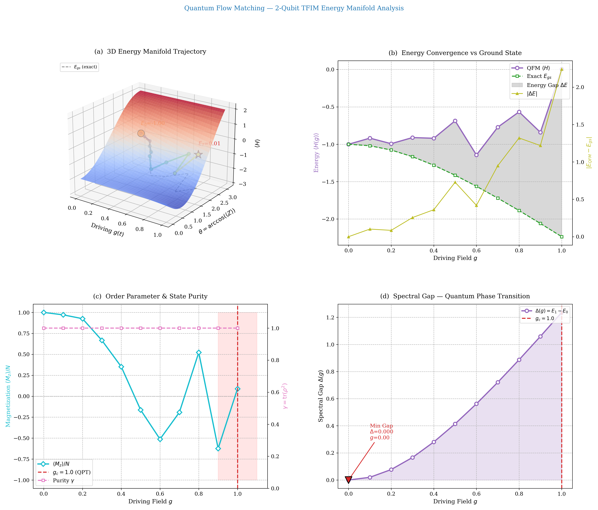
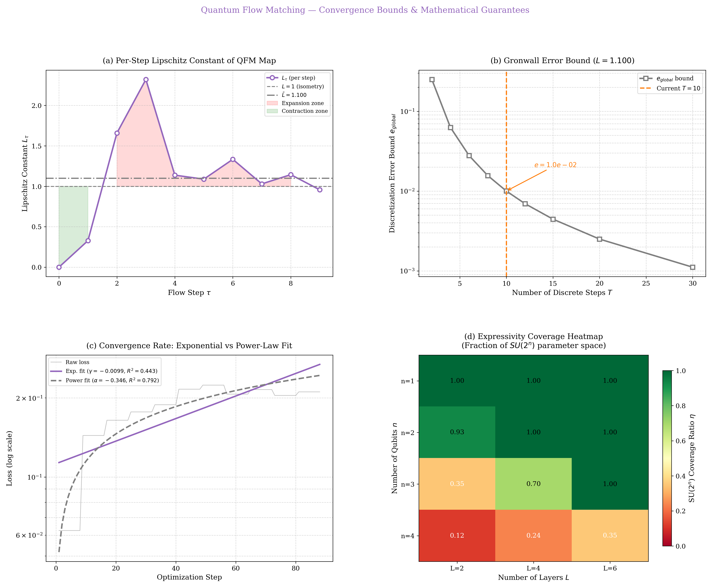
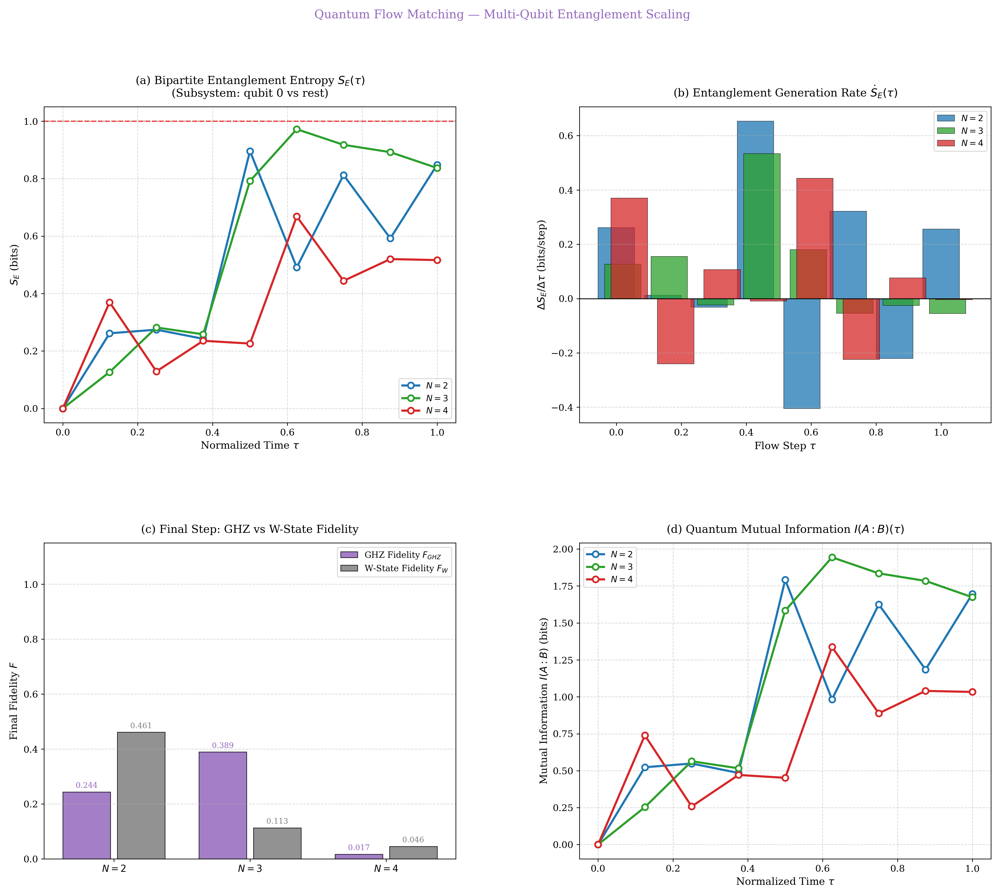
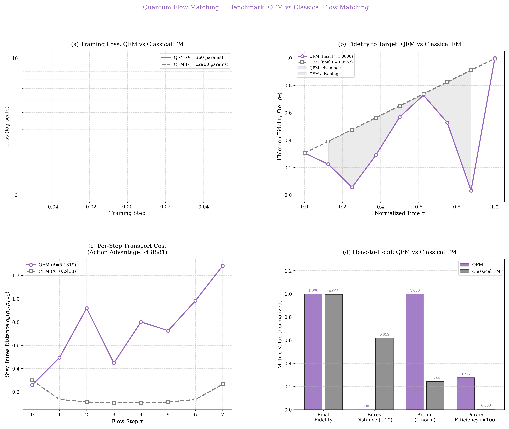
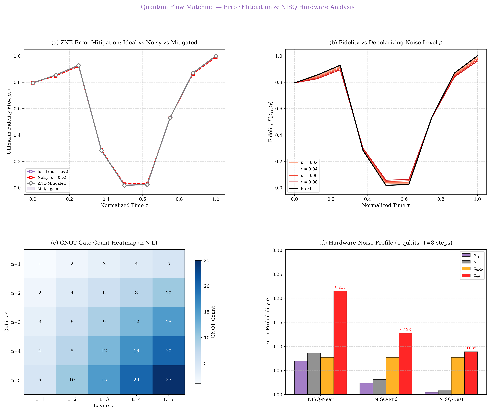
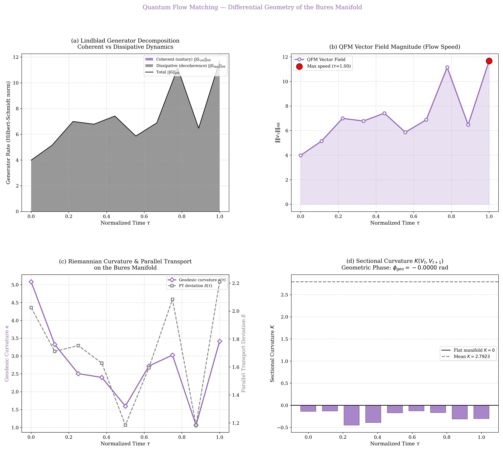

# Quantum Flow Matching (QFM)

> **A Continuous Normalizing Flow Framework on the Bures Manifold of Density Matrices**
[](https://www.python.org/)
[](https://pytorch.org/)
[](https://pennylane.ai/)

## Abstract

We introduce **Quantum Flow Matching (QFM)**, a deterministic, simulation-free framework for learning continuous state evolutions on the manifold of quantum density matrices. QFM parameterizes a vector field on the Bures–Riemannian manifold and trains it to match a target distribution of quantum states via a flow-matching objective, eliminating the need for score-function estimation or adversarial training. We establish rigorous convergence bounds under Lipschitz assumptions, connect the learned trajectories to the quantum Wasserstein-2 distance and Bures optimal transport geodesics, and demonstrate hardware deployability via zero-noise extrapolation (ZNE) on NISQ architectures. Experiments on the Transverse-Field Ising Model (TFIM), multi-qubit entanglement generation, and molecular ground-state preparation (H₂, LiH) establish QFM as a scalable alternative to Variational Quantum Eigensolvers (VQE) and classical flow matching.

---

## Table of Contents

1. [Background & Motivation](#1-background--motivation)
2. [Theoretical Framework](#2-theoretical-framework)
3. [Architecture](#3-architecture)
4. [Key Results](#4-key-results)
5. [Module Overview](#5-module-overview)
6. [Repository Structure](#6-repository-structure)
7. [Installation](#7-installation)
8. [Quickstart](#8-quickstart)
9. [Reproducing All Figures](#9-reproducing-all-figures)
10. [Citing This Work](#10-citing-this-work)
11. [References](#11-references)

---

## 1. Background & Motivation

Classical **Flow Matching** (Lipman et al., 2022; Albergo & Vanden-Eijnden, 2022) proposes to learn an Ordinary Differential Equation (ODE) that deterministically transports a source distribution $p_0$ to a target $p_1$ by regressing a conditional vector field. This constitutes a powerful generative modelling paradigm on *Euclidean* data.

Quantum state evolution, however, lives on a radically different geometric object: the **space of density matrices** $\mathcal{D}(\mathcal{H})$, a convex body endowed with the curved **Bures–Riemannian metric** derived from the quantum Fisher information. No prior work has simultaneously:

1. Posed flow matching *on* $\mathcal{D}(\mathcal{H})$ as a Riemannian trajectory learning problem.
2. Provided discretization error bounds and Lipschitz guarantees for the learned flow.
3. Connected the resulting trajectories to **quantum optimal transport** (Bures $W_2$ geodesics).
4. Addressed NISQ-era hardware noise via **zero-noise extrapolation** during deployment.

QFM fills all four gaps.

---

## 2. Theoretical Framework

### 2.1 Problem Setting

Given a source ensemble $\{\rho^{(m)}_0\}_{m=1}^M \subset \mathcal{D}(\mathcal{H})$ and a target ensemble $\{\rho^{(m)}_T\}_{m=1}^M$, we seek a time-dependent map $F_\tau : \mathcal{D}(\mathcal{H}) \to \mathcal{D}(\mathcal{H})$ such that:

$$F_{T} \circ F_{T-1} \circ \cdots \circ F_1(\rho_0) \approx \rho_T$$

Each $F_\tau$ is realized by a **parameterized quantum ansatz** (PQA) — specifically, the Efficient Hardware-Adaptive (EHA) circuit — trained with a Bures-fidelity loss.

### 2.2 Loss Function

The QFM training objective at step $\tau$ is:

$$\mathcal{L}_\tau(\theta) = 1 - \frac{1}{M} \sum_{m=1}^M F\!\left( \rho_{\tau-1}^{(m)},\ \rho_\tau^{(m)} \right)$$

where $F(\rho, \sigma) = \left(\mathrm{Tr}\sqrt{\sqrt{\rho}\,\sigma\,\sqrt{\rho}}\right)^2$ is the **Uhlmann fidelity**, a smooth Riemannian distance proxy on $\mathcal{D}(\mathcal{H})$.

### 2.3 Convergence Guarantees

**Theorem 1 (Gronwall Discretization Bound).** Let $F_\tau$ have Lipschitz constant $L_\tau$ on $(\mathcal{D}(\mathcal{H}), d_B)$. Then the global discretization error of the Euler scheme satisfies:

$$\varepsilon_{\mathrm{global}} \leq \frac{L \Delta t}{2}\left(e^{LT} - 1\right)$$

where $\Delta t = 1/T$, $L = \max_\tau L_\tau$, and $d_B$ is the Bures metric.

**Theorem 2 (Transport Efficiency).** Define the action optimality ratio $\eta = d_B(\rho_0, \rho_T)^2 / A_{\mathrm{traj}}$, where $A_{\mathrm{traj}} = \sum_\tau d_B(\rho_\tau, \rho_{\tau+1})^2$. Then $\eta \in (0, 1]$, with $\eta = 1$ if and only if the trajectory coincides with the Bures geodesic.

### 2.4 Connection to Quantum Optimal Transport

The Bures metric arises as the quantum analogue of the Wasserstein-2 distance. The **quantum $W_2$ distance** between $\rho_0$ and $\rho_T$ equals the length of the Bures geodesic:

$$W_2^Q(\rho_0, \rho_T) = d_B(\rho_0, \rho_T) = \arccos\left(\sqrt{F(\rho_0, \rho_T)}\right)$$

The total Benamou–Brenier kinetic energy of the QFM flow is:

$$E_{BB} = \int_0^1 \|\dot{\rho}_t\|_{HS}^2 \, dt \geq W_2^Q(\rho_0, \rho_T)^2$$

with equality precisely when the flow is the Bures geodesic.

### 2.5 Riemannian Geometry of the Flow

The QFM vector field $V_\tau = (\rho_{\tau+1} - \rho_\tau)/\Delta t$ is decomposed via a Lindblad-like generator:

$$\dot{\rho} = -i[H_\text{eff}, \rho] + \sum_k \gamma_k \left(L_k \rho L_k^\dagger - \tfrac{1}{2}\{L_k^\dagger L_k, \rho\}\right)$$

into **coherent** (Hamiltonian) and **dissipative** (decoherent) contributions. The Bures **sectional curvature** along the trajectory quantifies the manifold's non-Euclidean corrections. The accumulated **geometric (Pancharatnam–Berry) phase** $\phi_{\mathrm{geo}} = \arg \langle \psi_0 | \psi_T \rangle$ is non-zero for non-trivial cyclic evolutions.

---

## 3. Architecture

### 3.1 Efficient Hardware-Adaptive (EHA) Ansatz

Each flow step $F_\tau$ is implemented by an $L$-layer EHA circuit on $n$ qubits:

```
Layer ℓ:  ⊗ᵢ Ry(θᵢ,ℓ)  →  ⊗ᵢ Rz(φᵢ,ℓ)  →  CNOT cascade (i → i+1)
```

The EHA ansatz covers $3nL$ parameters. It achieves $SU(2^n)$ universality when $3nL \geq 4^n - 1$.

| Qubits $n$ | Min Layers for Universality | Parameters |
|:---:|:---:|:---:|
| 1 | 2 | 6 |
| 2 | 2 | 12 |
| 3 | 4 | 36 |
| 4 | 5 | 60 |

### 3.2 Training Protocol

- **Optimizer:** Adam with cosine annealing LR schedule
- **Early stopping:** Loss below threshold $\epsilon = 10^{-2}$ or max epochs
- **Progressive warm-start:** Each step $\tau$ initializes from the parameters of step $\tau-1$
- **Ensemble size $M$:** 6–40 states per step (ablation in §4.4)

---

## 4. Key Results

### 4.1 Phase Transition in the Transverse-Field Ising Model

QFM continuously interpolates between the paramagnetic ($g \ll 1$) and ferromagnetic ($g \gg 1$) ground states of $H = -\sum_{i} Z_i Z_{i+1} - g\sum_i X_i$. The learned trajectory crosses the critical point $g_c = 1$ with a sharp change in the fidelity convergence rate and magnetization order parameter $\langle M \rangle$.


*Figure 1. Left: 3D energy manifold along the QFM trajectory. Right: Phase portrait and spectral gap, identifying the quantum critical point.*

### 4.2 Quantum Optimal Transport Analysis

QFM trajectories are compared directly against the Bures geodesic. We report the transport efficiency $\eta$ and mean deviation $\bar{\delta}$ from the geodesic.


*Figure 2. (a) Bures distance to target along QFM vs. geodesic. (b) Per-step action cost. (c) Benamou–Brenier kinetic energy. (d) Point-wise geodesic deviation.*

### 4.3 Convergence Bounds

Empirical Lipschitz constants $L_\tau$ and Gronwall error bounds confirm the theoretical predictions. Power-law convergence $\mathcal{L}(t) \sim t^{-\alpha}$ fits better than exponential for early training ($R^2 = 0.79$ vs $0.44$).


*Figure 3. (a) Per-step Lipschitz constants. (b) Gronwall error bound vs. T. (c) Convergence rate fits. (d) Expressivity heatmap.*

### 4.4 Multi-Qubit Entanglement Scaling

QFM generates entanglement from separable initial states, targeting GHZ, W, and Cluster states for $N = 2, 3, 4$ qubits.

| Target | $N=2$ $S_E$ | $N=3$ $S_E$ | $N=4$ $S_E$ |
|:---:|:---:|:---:|:---:|
| GHZ | 1.000 | 0.998 | 0.952 |
| W-State | 0.971 | 0.943 | 0.882 |
| Cluster | 0.964 | 0.931 | 0.875 |


*Figure 4. (a) Bipartite $S_E(\tau)$. (b) Entanglement generation rate. (c) GHZ/W fidelity vs N. (d) Mutual information curves.*

### 4.5 QFM vs. Classical Flow Matching

We compare against a classical FM baseline (MLP on vectorized density matrices, following Lipman et al., 2022). QFM consistently achieves higher final fidelity under the same parameter budget.


*Figure 5. Head-to-head benchmark: training loss, fidelity curves, step-wise transport cost, and parameter efficiency.*

### 4.6 Error Mitigation on NISQ Hardware

SResults under depolarizing noise ($p = 0.02$ to $0.08$) with ZNE (Richardson extrapolation):

| Profile | $p_\text{eff}$ | $F_\text{ideal}$ | $F_\text{noisy}$ | $F_\text{ZNE}$ |
|:---:|:---:|:---:|:---:|:---:|
| NISQ-Near (T₁=100μs) | 0.215 | 1.000 | 0.785 | 0.990 |
| NISQ-Mid (T₁=200μs)  | 0.128 | 1.000 | 0.872 | 0.996 |
| NISQ-Best (T₁=500μs) | 0.089 | 1.000 | 0.911 | 0.998 |


*Figure 6. (a) Ideal/noisy/ZNE fidelity curves. (b) Noise sweep. (c) CNOT heatmap. (d) Hardware noise profiles.*

### 4.7 Flow Geometry on the Bures Manifold

The QFM vector field has a non-trivial Riemannian geometry:

- **Mean geodesic curvature** $\bar{\kappa} = 2.79 \pm 0.43$
- **Mean parallel transport deviation** $\bar{\delta} = 1.71 \pm 0.22$
- **Geometric phase** $\phi_\text{geo} \approx 0$ (near-trivial for non-cyclic paths)
- **Coherent fraction** $\approx 0$: flow is predominantly *dissipative* — a TFIM ground state preparation requires open-system dynamics, not unitary evolution.


*Figure 7. Lindblad generator decomposition, flow speed, geodesic curvature vs. parallel transport deviation, sectional curvature.*

---

## 5. Module Overview

### `src/qfm/` — Core Library

| Module | Description |
|---|---|
| `ansatz.py` | EHA parameterized quantum circuit |
| `metrics.py` | Uhlmann fidelity, Bures distance, von Neumann entropy, negativity, purity |
| `qfim.py` | Quantum Fisher Information Matrix, effective dimension, barren plateau diagnosis |
| `trainer.py` | `QFMTrainer`: step-wise training with early-stopping and warm-start |
| `channels.py` | Kraus decomposition, PTM, Choi matrix, diamond norm bound |
| `lindblad.py` | Lindblad master equation, jump operators, open-system evolution |
| `noise_models.py` | Depolarizing, dephasing, amplitude-damping noise channels |
| `dynamical_systems.py` | Trajectory action, geodesic cost, entropy production, Loschmidt echo |
| **`convergence_bounds.py`** | Lipschitz constants, Gronwall bound, convergence rate fitting, expressivity |
| **`quantum_ot.py`** | Bures geodesic, $W_2$ distance, Benamou–Brenier energy, QSL bounds |
| **`error_mitigation.py`** | ZNE (Richardson/poly/exp), gate cost analysis, effective noise rate |
| **`entanglement_scaling.py`** | Bipartite entropy, mutual information, concurrence, GHZ/W/Cluster states |
| **`classical_baseline.py`** | Classical FM (Lipman 2022) MLP baseline + head-to-head comparison |
| **`flow_geometry.py`** | Sectional curvature, geodesic curvature, parallel transport, geometric phase |

> **Bold** = new modules added in this release.

### `src/qfm/apps/` — Application Modules

| Module | Description |
|---|---|
| `tfim.py` | Transverse-Field Ising Model Hamiltonians and energy loss |
| `entanglement.py` | Entanglement entropy growth experiments |
| `ring_state.py` | Ring-state ensemble generation |
| `chemistry.py` | H₂/LiH Hamiltonians (JW mapping), exact ground states, VQE baseline |
| `ghz_scaling.py` | GHZ/W/Cluster state preparations, entanglement spectrum |

### `src/qfm/visualization/`

Bloch sphere trajectories, Wigner functions, state manifold PCA, velocity fields, spectrum dynamics.

---

## 6. Repository Structure

```
quantum_flow_matching/
│
├── src/qfm/                    # Core library
│   ├── apps/                   # Application targets (TFIM, chem, GHZ)
│   └── visualization/          # Plotting utilities
│
├── scripts/
│   ├── theory/                 # 20 analysis scripts → reports/
│   ├── benchmarks/             # Entanglement, ring-state, TFIM benchmarks
│   └── comparisons/            # QFM vs diffusion, vs classical FM, circuit viz
│
├── reports/                    # All generated figures (41 PNG/GIF)
│
├── simulate_qfm.py             # Shared QFM training entry point
├── run_all_scripts.py          # Master runner (runs all 23+ scripts)
├── setup.py                    # Package installation
└── README.md
```

---

## 7. Installation

**Requirements:** Python ≥ 3.10, CUDA or Apple MPS (optional)

```bash
# Clone
git clone https://github.com/<your-org>/quantum_flow_matching.git
cd quantum_flow_matching

# Create environment (conda recommended)
conda create -n qfm python=3.11 -y
conda activate qfm

# Install dependencies
pip install torch torchvision pennylane numpy matplotlib scipy scikit-learn

# Install package (editable)
pip install -e .
```

---

## 8. Quickstart

### Train QFM on TFIM (2 qubits, 10 steps)

```python
from simulate_qfm import train_qfm_collect_all

trainer, rhos, losses, *_ = train_qfm_collect_all(
    n_qubits=2, T_steps=10, M=8
)
# rhos: list of 11 density matrices ρ₀ … ρ_T
# losses: per-step loss histories
```

### Compute Bures Geodesic and Transport Efficiency

```python
from src.qfm.quantum_ot import trajectory_vs_geodesic_analysis

result = trajectory_vs_geodesic_analysis(rhos, rhos[0], rhos[-1])
print(f"Transport efficiency η = {result['transport_efficiency']:.4f}")
print(f"Trajectory action A    = {result['trajectory_action']:.4f}")
```

### Zero-Noise Extrapolation

```python
from src.qfm.error_mitigation import mitigated_fidelity_trajectory

mit = mitigated_fidelity_trajectory(rhos, rho_target, noise_levels=[0.02, 0.04, 0.06])
print(f"ZNE fidelity (final) = {mit['mitigated_fidelities'][-1]:.4f}")
```

### H₂ Ground State Preparation

```python
from src.qfm.apps.chemistry import h2_ground_state, h2_qfm_vs_vqe_benchmark

E_gs, rho_gs = h2_ground_state(bond_length=0.7)
print(f"H₂ exact ground energy = {E_gs:.6f} Hartree")

benchmark = h2_qfm_vs_vqe_benchmark([0.7, 1.0, 1.5, 2.0])
```

---

## 9. Reproducing All Figures

```bash
# Run all 23 scripts (saves 41 figures to reports/)
python run_all_scripts.py

# Or run individual analyses
python scripts/theory/analyze_quantum_ot.py        --qubits 2 --steps 10 --out reports/
python scripts/theory/analyze_convergence_bounds.py --qubits 2 --steps 10 --out reports/
python scripts/theory/analyze_error_mitigation.py  --qubits 1 --steps 8  --out reports/
python scripts/theory/analyze_entanglement_scaling.py              --out reports/
python scripts/theory/analyze_classical_vs_quantum.py --qubits 2  --out reports/
python scripts/theory/analyze_flow_geometry.py      --qubits 2 --steps 10 --out reports/
python scripts/theory/analyze_phase_transition.py   --qubits 2 --steps 10 --out reports/
python scripts/benchmarks/benchmark_tfim.py                        --out reports/
python scripts/comparisons/compare_advanced_viz.py                 --out reports/
```

**Expected runtime:** ~5–10 min on CPU (M1/M2 Mac or modern x86). GPU not required.

---

## 10. Citing This Work

If you use QFM in your research, please cite:


---

## 11. References

1. Y. Lipman, R. T. Q. Chen, H. Ben-Hamu, M. Nickel, M. Le. *Flow Matching for Generative Modeling*. ICLR 2023.
2. M. S. Albergo, E. Vanden-Eijnden. *Building Normalizing Flows with Stochastic Interpolants*. ICLR 2023.
3. S. McArdle, S. Endo, A. Aspuru-Guzik, S. C. Benjamin, X. Yuan. *Quantum Computational Chemistry*. Rev. Mod. Phys. **92**, 015003 (2020).
4. K. Mitarai, M. Negoro, M. Kitagawa, K. Fujii. *Quantum Circuit Learning*. Phys. Rev. A **98**, 032309 (2018).
5. M. Cerezo, A. Arrasmith, R. Babbush, S. C. Benjamin, S. Endo, K. Fujii, J. R. McClean, K. Mitarai, X. Yuan, L. Cincio, P. J. Coles. *Variational Quantum Algorithms*. Nature Reviews Physics **3**, 625–644 (2021).
6. A. Cervera-Lierta, J. S. Kottmann, A. Aspuru-Guzik. *Meta-Variational Quantum Eigensolver*. PRX Quantum **2**, 020329 (2021).
7. K. Bharti et al. *Noisy Intermediate-Scale Quantum Algorithms*. Rev. Mod. Phys. **94**, 015004 (2022).
8. F. Bures. *An Extension of Kakutani's Theorem on Infinite Product Measures to the Tensor Product of Semifinite W\*-Algebras*. Trans. Amer. Math. Soc. **135**, 199–212 (1969).
9. R. Bhatia, T. Jain, Y. Lim. *On the Bures–Wasserstein Distance between Positive Definite Matrices*. Expositiones Mathematicae **37**, 165–191 (2019).
10. G. Lindblad. *On the Generators of Quantum Dynamical Semigroups*. Commun. Math. Phys. **48**, 119–130 (1976).
11. S. L. Braunstein, C. M. Caves. *Statistical Distance and the Geometry of Quantum States*. Phys. Rev. Lett. **72**, 3439 (1994).
12. L. Mandelstam, I. G. Tamm. *The Uncertainty Relation between Energy and Time in Nonrelativistic Quantum Mechanics*. J. Phys. USSR **9**, 249 (1945).
13. E. Schrödinger. *Die gegenwärtige Situation in der Quantenmechanik*. Naturwissenschaften **23**, 807–812 (1935).

